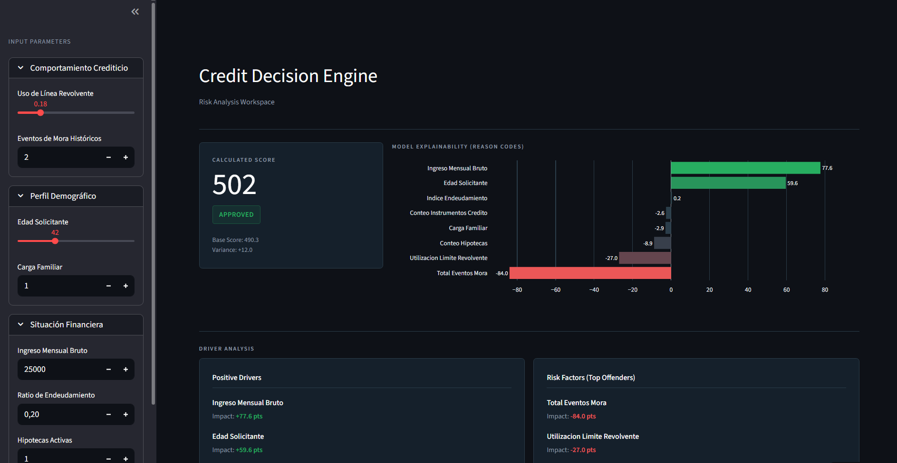

# Proyecto de Credit Scoring: Predicción de Incumplimiento

> **¡Prueba la aplicación!** Puedes interactuar con el modelo y realizar predicciones en tiempo real a través de  [Credit Decision Engine en Streamlit](https://creditdecisionengine-byclaudiochavarria.streamlit.app/).


*Vista previa de la interfaz de usuario del motor de decisiones de crédito.*

---

## I. Contexto Estratégico y Descripción del Proyecto

Este proyecto desarrolla un modelo predictivo de **Credit Scoring**, el cual es un instrumento fundamental para la asignación de capital bancario. Un sistema de scoring eficiente permite diferenciar perfiles de riesgo con precisión, asegurando la rentabilidad institucional y mitigando la morosidad estructural.

El problema de negocio principal radica en las ineficiencias financieras generadas por modelos con baja capacidad discriminatoria:
*   **Pérdida Directa:** Aprobación de créditos a perfiles de alto riesgo que terminan en default.
*   **Costo de Oportunidad:** Rechazo de clientes solventes (falsos positivos de riesgo), lo que limita el crecimiento orgánico de la cartera.

**Objetivo Central:** Predecir la probabilidad de que un prestatario caiga en mora severa (evento de default) en un horizonte temporal de 2 años. Se busca maximizar la métrica **ROC-AUC** y optimizar el estadístico **KS (Kolmogorov-Smirnov)** para garantizar el mayor poder de discriminación posible.

* **Origen de los Datos:** Este proyecto utiliza el dataset oficial de la competencia de Kaggle [Give Me Some Credit](https://www.kaggle.com/c/GiveMeSomeCredit).

---

## II. Estructura del Directorio

El repositorio del proyecto sigue una arquitectura estándar y escalable para proyectos de ciencia de datos, organizada de la siguiente manera:

*   `app/`: Contiene el código fuente de la aplicación en Streamlit y recursos visuales para el despliegue del modelo predictivo (ej. `app_example.png`).
*   `data/`: Directorio destinado al almacenamiento de los datos.
    *   `raw/`: Datos originales sin procesar descargados de Kaggle (ej. `cs-training.csv`).
    *   `processed/`: Datos limpios, imputados y transformados, listos para el entrenamiento (ej. `cs-training-clean.csv`, `log_exclusiones_edad.csv`).
*   `models/`: Directorio para guardar los modelos serializados y entrenados listos para inferencia.
*   `notebooks/`: Cuadernos de Jupyter (Jupyter Notebooks) utilizados para la exploración, el análisis descriptivo y la ingeniería de características.
*   `retail_scoring_env/`: Entorno virtual de Python configurado específicamente para aislar las dependencias del proyecto.
*   `README.md`: Documento principal de documentación del proyecto.
*   `requirements.txt`: Archivo que detalla las dependencias y librerías de Python necesarias para replicar el entorno.

---

## III. Metodología (CRISP-DM)

El proyecto se rige estrictamente por la metodología estándar de la industria **CRISP-DM** (Cross-Industry Standard Process for Data Mining). A continuación se explican a detalle las fases desarrolladas:
# Metodología del Proyecto (CRISP-DM)

### Fase 1: Comprensión del Negocio (Business Understanding)
El objetivo es predecir la probabilidad de que un prestatario caiga en mora severa (evento de default) en un horizonte de 2 años[cite: 1]. Un sistema de scoring eficiente diferencia perfiles de riesgo, asegurando la rentabilidad y mitigando la morosidad[cite: 1].
* **Variable Objetivo:** `indicador_default` (Mora ≥ 90 días en 24 meses)[cite: 1].
* **KPIs:** Maximizar ROC-AUC y optimizar el estadístico KS (Kolmogorov-Smirnov) para garantizar poder de discriminación[cite: 1].

### Fase 2: Comprensión de los Datos (Data Understanding)
Se analizó una muestra histórica de 150,000 registros de la competencia "Give Me Some Credit" de Kaggle[cite: 1].
* **Calidad de Datos:** Se detectaron nulos en `ingreso_mensual_bruto` (19.82%) y `carga_familiar` (2.61%)[cite: 1].
* **Anomalías:** Presencia de edades imposibles (0 años) y códigos de error sistémico (96 y 98) en el historial de mora[cite: 1].
* **Distribución:** La mayoría de las variables presentan un sesgo positivo extremo, con colas largas causadas por errores de escala en los ratios[cite: 1].

### Fase 3: Preparación de los Datos (Data Preparation)
Se generó el dataset `df_clean` aplicando transformaciones para garantizar la gobernanza del dato[cite: 1]:
* **Tratamiento de Edad:** Exclusión de registros con edad <= 0 o > 90 años, generando un log de auditoría[cite: 1].
* **Clipping (Truncamiento):** Se aplicó un tope superior en 2.0 para `utilizacion_limite_revolvente` e `indice_endeudamiento`[cite: 1]. Los códigos de error en morosidad se toparon en 20[cite: 1].
* **Imputación:** El ingreso mensual se imputó con la **mediana** (tras un clipping a $25,000) y la carga familiar con la **moda**[cite: 1].
* **Flags de Control:** Se crearon variables binarias para marcar cada registro que fue imputado o recortado[cite: 1].

### Fase 4: Modelado (Modeling)
Debido a que el dataset está fuertemente desbalanceado (solo 6.68% de casos de mora), se implementaron las siguientes estrategias:
* **Selección de Algoritmos:** Se compararon modelos de Regresión Logística (baseline interpretable), Random Forest y XGBoost.
* **Técnicas de Balanceo:** Uso de pesos de clase (*Class Weights*) y validación cruzada estratificada para asegurar que el modelo aprenda a identificar la clase minoritaria.
* **Optimización:** Búsqueda de hiperparámetros para mejorar la generalización del modelo frente a datos no vistos.

### Fase 5: Evaluación (Evaluation)
La validación se centró en métricas de negocio más allá de la precisión global:
* **Poder de Discriminación:** El estadístico KS permitió validar qué tan bien se separan las poblaciones de "buenos" y "malos" pagadores.
* **Curva ROC:** Evaluación de la sensibilidad del modelo para capturar el default sin penalizar excesivamente a los clientes solventes.
* **Importancia de Características:** Análisis de los predictores clave; típicamente la utilización de crédito y el historial de mora severa son los factores más determinantes.

### Fase 6: Despliegue (Deployment)
El modelo fue integrado en un motor de decisiones funcional:
* **Aplicación Streamlit:** Interfaz de usuario donde se pueden ingresar los datos financieros para obtener una probabilidad de riesgo inmediata.
* **Pipeline de Inferencia:** El sistema replica automáticamente la limpieza de la Fase 3 (clipping e imputación) sobre los datos de entrada antes de realizar la predicción.
* **Sugerencia de Decisión:** Basado en umbrales de probabilidad, el motor categoriza la solicitud en riesgo bajo (aprobación), medio (revisión) o alto (rechazo).
---

## IV. Pasos para la Configuración y Ejecución

Para reproducir el entorno, ejecutar los cuadernos de análisis o levantar la aplicación localmente, siga estos pasos:

### 1. Clonar el repositorio y navegar a la raíz
Abra su consola de preferencia y diríjase a la carpeta del proyecto.

### 2. Activar el entorno virtual
cree un entorno y utilice requirements.txt :

```bash
# Para entornos basados en Linux/Mac
source retail_scoring_env/bin/activate

# Para entornos basados en Windows
retail_scoring_env\Scripts\activate